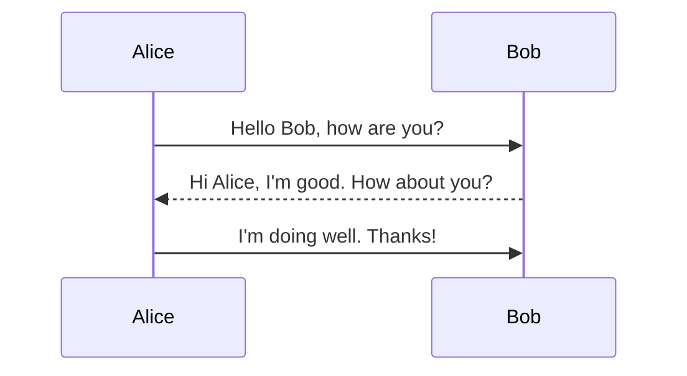

To install mermaid use:
```sh
npm install -g @mermaid-js/mermaid-cli
```




mmdc -i diagram.mmd -o diagram.png -t forest -b white

For example, to convert a Mermaid file (`diagram.mmd`) to a PNG image:

```sh
mmdc -i diagram.mmd -o diagram.png
```

To convert the same file to an SVG:

```sh
mmdc -i diagram.mmd -o diagram.svg
```

3. **Additional options:**
   - `-i`: specifies the input Mermaid file.
   - `-o`: specifies the output image file.
   - `-t`: sets the theme (default is `default`).
   - `-b`: background color for the chart (default is `transparent`).

Here is an example with more options:

```sh
mmdc -i diagram.mmd -o diagram.png -t forest -b white
```

