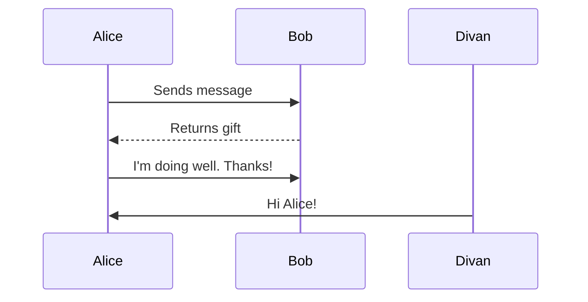

# This is a title
The following is an image


The following is a sequence diagram
rendered to an image

```mermaid
sequenceDiagram
    participant Alice
    participant Bob
    participant d as Divan

    Alice->>Bob: Sends message
    Bob-->>Alice: Returns gift
    Alice->>Bob: I'm doing well. Thanks!
    d->>Alice: Hi Alice!
```

To install mermaid use:

```sh
npm install -g @mermaid-js/mermaid-cli
```

